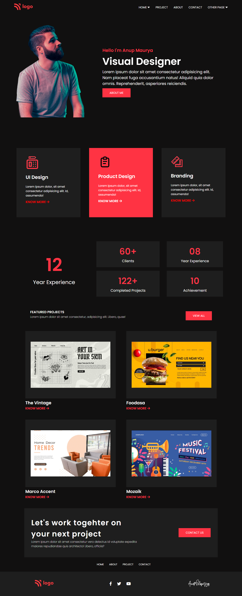

# **Anup Kumar Maurya** #

## **Topics I Learned** ##
>Everthing I had learned is completly revised while doing this awesome project in black theme which is really insane. I loved the project theme.

>A lot of HTML and CSS code to work with.

>Flexbox is boon for us which can solve every design problem just by putting display to flex. Unleashing the real power of flexbox.

>Media Query opens a gate for responsiveness.

## **Time Taken** ##
>It takes me around 6 hours only.

## **Final Output** ##

## **Live Link** ##

